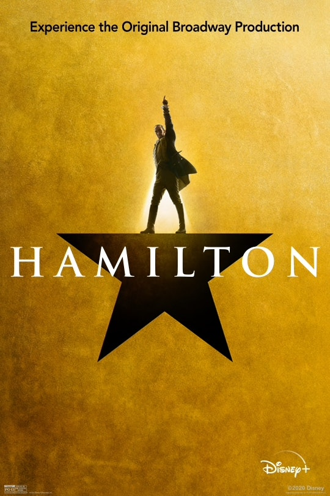

*Hamilton* has finally launched on Disney+, over a year earlier than originally slated. It's been interesting to go through the release of Hamilton all over again, five years after it premiered. 2015---and the subsequent 2016 mania---seems like a world away. A show that was universally esteemed back then---[there were](https://www.currentaffairs.org/2016/07/you-should-be-terrified-that-people-who-like-hamilton-run-our-country) [dissenters](https://www.currentaffairs.org/2019/02/ishmael-reed-doesnt-like-hamilton)! but they seemed to be drowned out by Michelle Obama calling it [the greatest work of art she'd ever experienced](https://mashable.com/2016/03/14/michelle-obama-hamilton/)---has had its fair share of [reconsiderations and critical thought](https://news.harvard.edu/gazette/story/2016/10/correcting-hamilton/?fbclid=IwAR31b1xKkGZ2nvp2xGl_cRUngrmG5TLBigknNhKxV_E9_DrJKsh9FfMnPPk) over the years. The world---and culture--is in a much different place than it was.

Suddenly, however, *Hamilton* is back and it's a huge success---no surprise. [It's driving downloads of Disney+](https://variety.com/2020/digital/news/hamilton-disney-plus-premiere-app-downloads-72-percent-1234698795/), and interest is at an all-time high:

*uh*

But times have changed. I won't re-iterate [what others have written about before](https://www.currentaffairs.org/2016/07/you-should-be-terrified-that-people-who-like-hamilton-run-our-country), but what felt like a radical reclaiming of history in 2016 now feels a bit, well, simplistic. For one, there's a type of Obama-era naïveté present when we look at *Hamilton* now. By heroizing the founding fathers and largely erasing their sins of slavery---even with (or, even more sadly, especially with) BIPOC playing these roles---you get a piece of pop culture perfectly aligned for white neoliberal elites. The idea that this was an artistic piece that "unified" us under its scrappy patriotism was a centrist, shortsighted myth. Fundamentally, *Hamilton* is a show that celebrates our founding fathers, that gives them a mostly free pass for their evils. Hell, how radical can you be [when Dick Cheney loves your show](https://thehill.com/blogs/in-the-know/in-the-know/272964-obama-hamilton-is-the-only-thing-dick-cheney-and-i-agree-on)?

Which isn't to erase the achievements of *Hamilton*, which I was obsessed with for all of 2015/2016. Lin-Manuel Miranda created a work of furiously American pop culture that is riddled with some of the same contradictions of the country itself. He himself has acknowledged that he couldn't cover it all, and that the criticisms are valid:

But it might be easier to forgive the show for its flaws if it weren't for its post-fame production path, which has turned a work of theatre not only into a hyper-capitalist status symbol of a ticket, but now a Disney-presented movie. Disney, which bought the movie rights to the *recording of a stage play *[for a cool $75 million](https://deadline.com/2020/02/disney-paid-75-million-hamilton-movie-deal-lin-manuel-miranda-largest-film-acquisition-ever-1202849929/) (!!), is a company that wants to convince us that it's on the "good side" of the conversation around representation and diversity (don't worry, [they secured the Kaepernick deal](https://variety.com/2020/tv/news/colin-kaepernick-walt-disney-first-look-deal-espn-1234698911/)). So while there's something perverse about seeing the Disney Logo bookend the *Hamilton* movie, there's something also infuriatingly on-brand about it. The *Hamilton* producers have been ruthless with how they've monopolized and monetized their "product" (sadly, there will be no other director's version of *Hamilton* for a long, long time); [Disney does the same thing](https://www.vulture.com/2019/10/disney-is-quietly-placing-classic-fox-movies-into-its-vault.html) with its fabled "vault".

It makes sense that Disney would be able to market *Hamilton* to its customers. It's the perfect addition to their lineup, to sell a vision of America that has the veneer of the fresh and radical without ruffling too many feathers. They're desperate for this venn diagram of material. Because when you look inside the castle, [what you see is not pretty](https://theankler.com/p/class-photos):

*yikes!! [it goes on](https://theankler.com/p/class-photos), but I've trimmed it here for all our sake*

I want to be clear: I *do* think it's great that there is a well-produced video of a Broadway show that enables millions more to be able to "experience" it at home. Theatre has a long, long way when it comes to this kind of digital accessibility. In an ideal world, every successful Broadway show *should* have this kind of (expensive) recording done. And there needs to be a platform to seamlessly distribute video to those who want to see! But what I find more distressing about this whole situation is that [this *Hamilton* recording was from **four years ago**](https://www.nytimes.com/2020/06/25/movies/hamilton-movie-disney-streaming.html). It took this long to get out to people because the producers needed to squeeze every last drop of money out of this as possible, and eventually submit to the Disney Machine. This isn't a triumph for theatre and digital media; it's the unfortunate reality that rich shows like *Hamilton* are the ones that get this platform, and only when they participate in [a racist, capitalist system](https://www.nytimes.com/interactive/2019/08/14/magazine/slavery-capitalism.html) that isn't equipped to serve the needs of theatre, or the needs of the young and scrappy immigrants that the show claims to be about. That's not the type of future I want for theatre or [believe that art needs](https://www.guscuddy.com/unprofitability).
